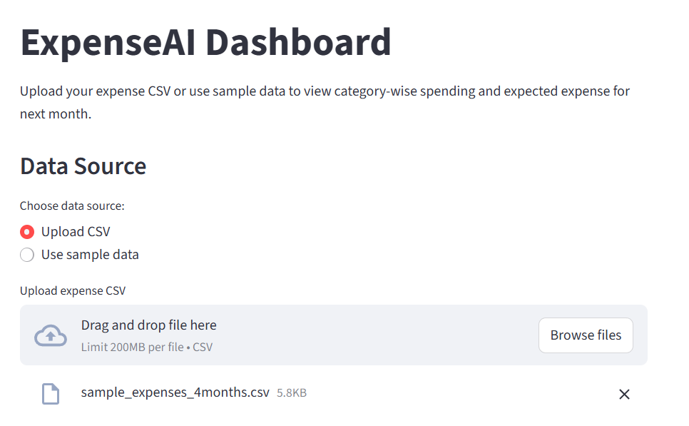
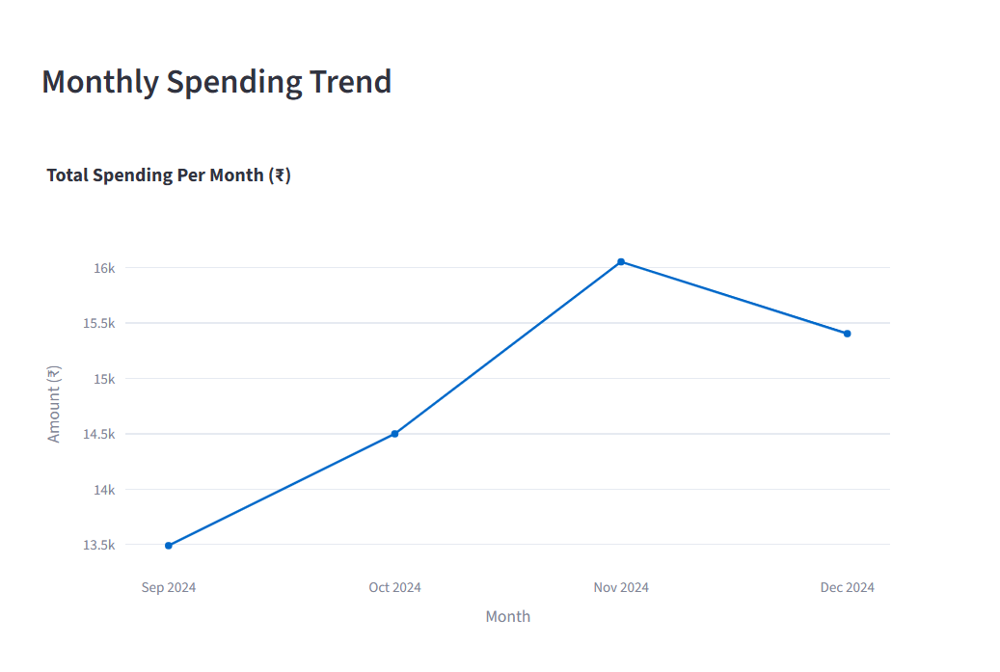
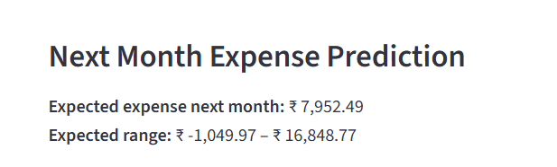
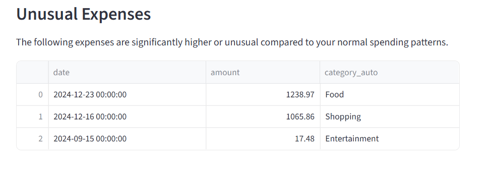

#ExpenseAI

ExpenseAI is a lightweight data analytics dashboard that helps users analyze their expense data.  
Users can upload a CSV file (or use sample data) to visualize spending patterns, detect unusual expenses, and estimate next month’s spending.

## ✨ Features

- 📂 **CSV Upload or Sample Data**
- 🧾 **Automatic Expense Categorization**
- 🥧 **Category-wise Spending Breakdown (Pie Chart)**
- 📈 **Monthly Spending Trend (Line Chart)**
- 🔮 **Next Month Expense Prediction**
- 🚨 **Unusual Expense Detection (Anomaly Detection)**

## 🛠️ Tech Stack

- **Python**
- **Pandas**
- **Scikit-learn**
- **Prophet** (Time-series forecasting)
- **Streamlit** (Dashboard)
- **Plotly** (Interactive charts)

## 📸 Screenshots

### 📂 Data Upload & Dashboard Overview
Upload your expense CSV or use sample data to view insights.

---

### 🥧 Category-wise Expense Breakdown
Shows how total spending is distributed across categories.

---

### 📈 Monthly Spending Trend
Displays month-wise total spending using a line chart.

---

### 🔮 Next Month Expense Prediction
Estimates next month’s expected spending along with the expected range.

---

### 🚨 Unusual Expenses
Highlights unusually high or rare expenses for user review.

